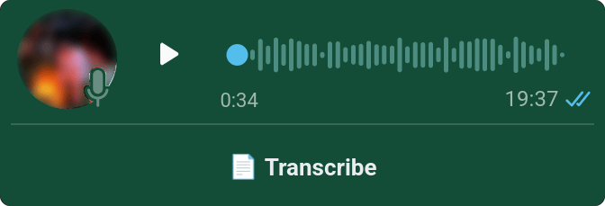
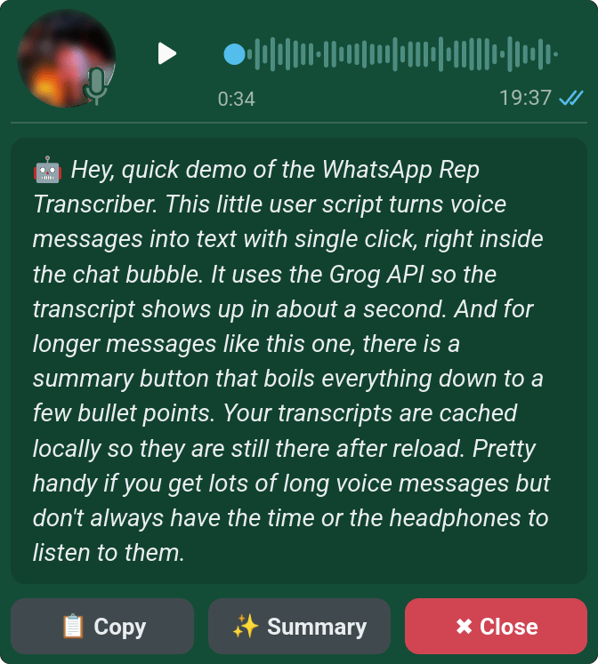
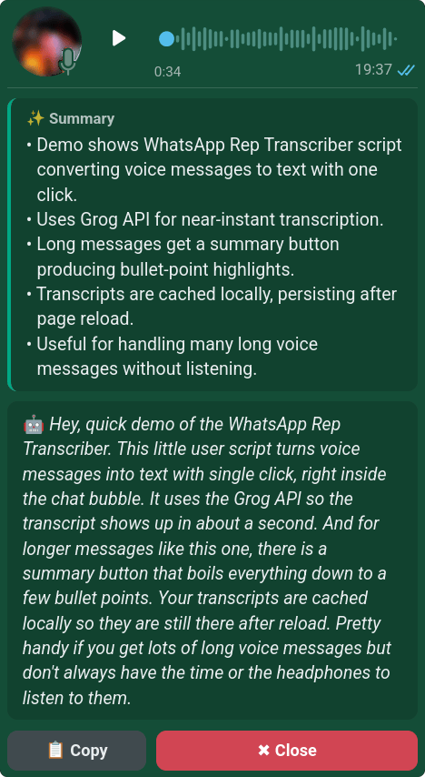

# 💬 WhatsApp Web Voice Transcriber

  

**A lightweight, robust Tampermonkey Userscript that transcribes WhatsApp Web voice messages into text with a single click, and summarizes the long ones. Powered by the blazing-fast Groq API (Whisper-large-v3 and GPT-OSS 120B).**

## 📸 Screenshots

<table>
  <tr>
    <td colspan="2" align="center">
       
      <em>One click on "Transcribe", right inside the chat bubble.</em>
    </td>
  </tr>
  <tr>
    <td width="50%" valign="top" align="center">
       
      <em>The transcript appears directly below the audio, ready to copy.</em>
    </td>
    <td width="50%" valign="top" align="center">
       
      <em>Longer messages can be boiled down to a few bullet points.</em>
    </td>
  </tr>
</table>

## ✨ Features

* **One-Click Transcription:** No need to download files manually or use external bots.
* **✨ Summaries:** Voice messages longer than about 30 seconds get a "Summary" button that condenses them into a few bullet points.
* **Blazing Fast:** Uses Groq's API for near-instant text generation.
* **Works in Every Language:** The buttons appear regardless of your WhatsApp Web UI language.
* **Remembers Transcripts:** Transcripts and summaries are saved locally, so they survive scrolling and reloads without a second API call.
* **Seamless UI:** The transcription and buttons are injected directly into the chat bubble, matching WhatsApp's dark and light theme.
* **Copy to Clipboard:** Instantly copy the transcribed text.
* **Auto-Language Detection:** Automatically detects the spoken language, or lets you manually enforce a specific language code via the Tampermonkey menu.
* **No "Played" Receipt:** The voice message is downloaded, never played, so the sender does not see it as listened to.
* **Secure Key Management:** Your API key is stored locally in your browser, never shared.

## 🚀 Installation

1. Install a Userscript manager for your browser (e.g., [Tampermonkey](https://www.tampermonkey.net/)).
2. Click the link below to install the script:
   👉 **[Install WhatsApp Web Voice Transcriber](https://raw.githubusercontent.com/DevEmperor/WhatsApp-Web-Transcriber/main/WhatsApp-Web-Transcriber.user.js)**
3. Confirm the installation in the Tampermonkey tab that opens.

Updates are installed automatically by Tampermonkey.

## 🔑 Getting your free API Key

This script uses the Groq API to transcribe and summarize the audio. You need a free API key to use it:

1. Go to the [Groq Console](https://console.groq.com/keys).
2. Create a free account or log in.
3. Generate a new API Key (it starts with `gsk_...`).
4. The first time you click "Transcribe" in WhatsApp Web, the script will ask for this key. Paste it there, and it will be saved locally.

The free tier is plenty for personal use, but it has [rate limits](https://console.groq.com/docs/rate-limits). If you hit one, the script tells you how long to wait.

## 🛠️ Usage

1. Open [WhatsApp Web](https://web.whatsapp.com/).
2. Open any chat containing a voice message.
3. You will see a new **"📄 Transcribe"** button attached to every voice message bubble.
4. Click it and wait a few seconds. The text will appear right below the audio!
5. For longer messages, click **"✨ Summary"** to get the key points on top of the transcript.

**"✖ Close"** only hides the transcript. Clicking "Transcribe" again shows it instantly from the local cache.

### Menu Commands

Click the Tampermonkey extension icon while WhatsApp Web is open:

| Command | What it does |
| :--- | :--- |
| 🔑 Change API Key | Replace your stored Groq API key. |
| 🌐 Change Language (Auto/Manual) | Force a language code like `de` or `en`, or leave it blank for auto-detection. |
| 🗑️ Clear Transcript Cache | Delete all locally saved transcripts and summaries. |
| 🩺 Copy Diagnostics | Copy a technical report for bug reports (see below). |

## 🔒 Privacy

* The audio of a voice message is sent to Groq only when you click "Transcribe", and the transcript only when you click "Summary". See [Your Data in GroqCloud](https://console.groq.com/docs/your-data) for how Groq handles API requests.
* Your API key and the transcript cache (up to 500 messages) are stored in Tampermonkey's local storage. Nothing else leaves your browser.

## 🩺 Troubleshooting

WhatsApp Web changes its layout from time to time. If the buttons disappear or transcription stops working:

1. Open a chat with a voice message.
2. Click the Tampermonkey icon and choose **"🩺 Copy Diagnostics"**.
3. [Open an issue](https://github.com/DevEmperor/WhatsApp-Web-Transcriber/issues/new) and paste the report.

The report only contains the page structure: message texts, phone numbers and sender names are masked. Please skim it before posting anyway.

## 📝 Changelog

See [CHANGELOG.md](CHANGELOG.md).

## 📜 License

This project is licensed under the **GPL-3.0 License** - see the [license file](LICENSE) for details.
